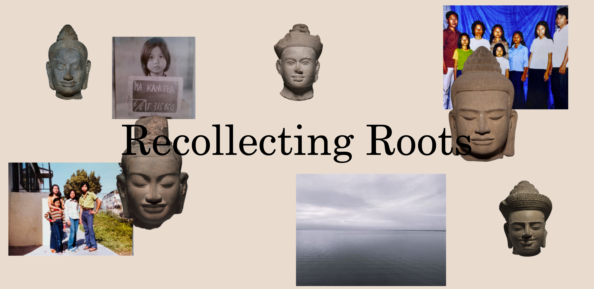

# Recollecting Roots

This project explores the complex cultural and religious identity of being Cambodian-American and the lasting effects of exploitation, displacement, and trauma. 

Final project for INMD214 Spring 2025. 
